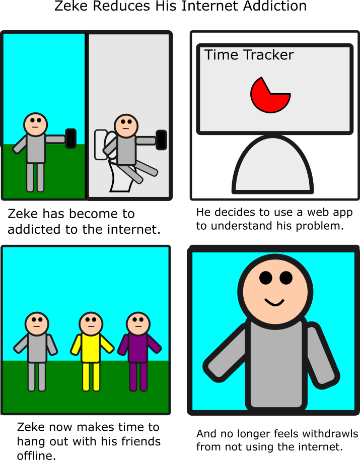
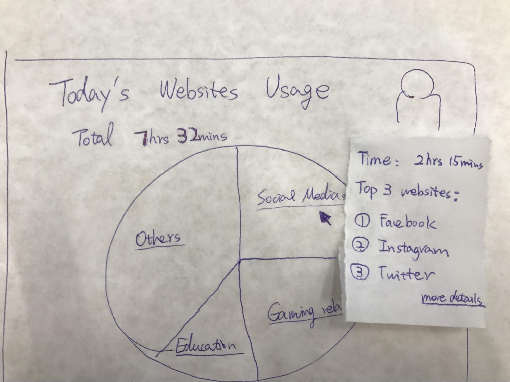
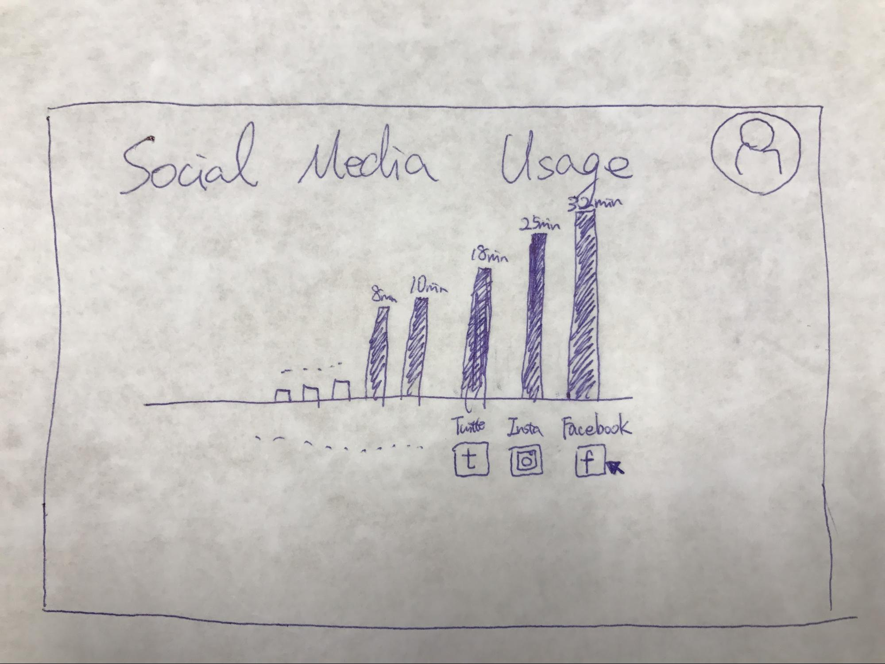
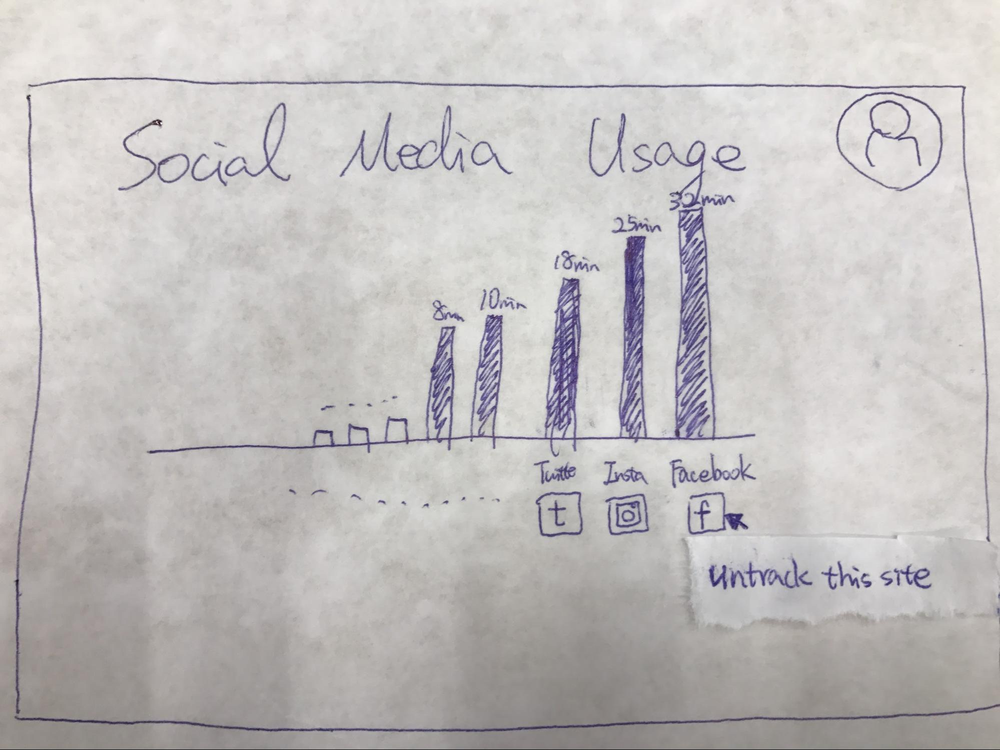
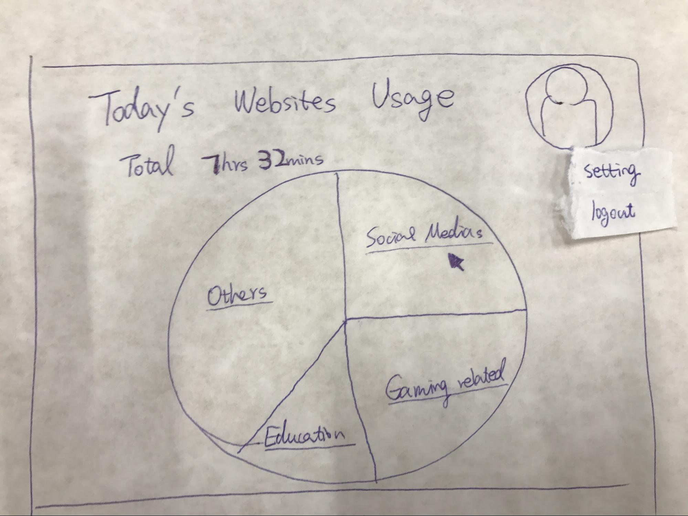

Storyboard #1

Storyboard #2

Prototype #1:
Home Page

Hover on the stats

Click on Social Media Site

Click on the site

Click on user icon

Click on settings

Prototype #2:
This prototype focuses on having most of the content appear on the singular main page. So instead of going to separate pages the page will simply load more content extending the page. 

Home page

Hover over one of the sectors of the home page pie chart revealing a brief summary of info.

Click on one of the sectors of the pie chart and it will extend the page with a more detailed display and analysis of the chosen category. 

Hover over one of the specific sectors of the pie chart to reveal even more detailed information.

Click on account to access the settings page (need to rename account button to settings)

Settings page with dropdowns for tracking, alerts, deleting ones account and a log out button.

Click on one of the dropdowns to get the detailed information of that specific setting
