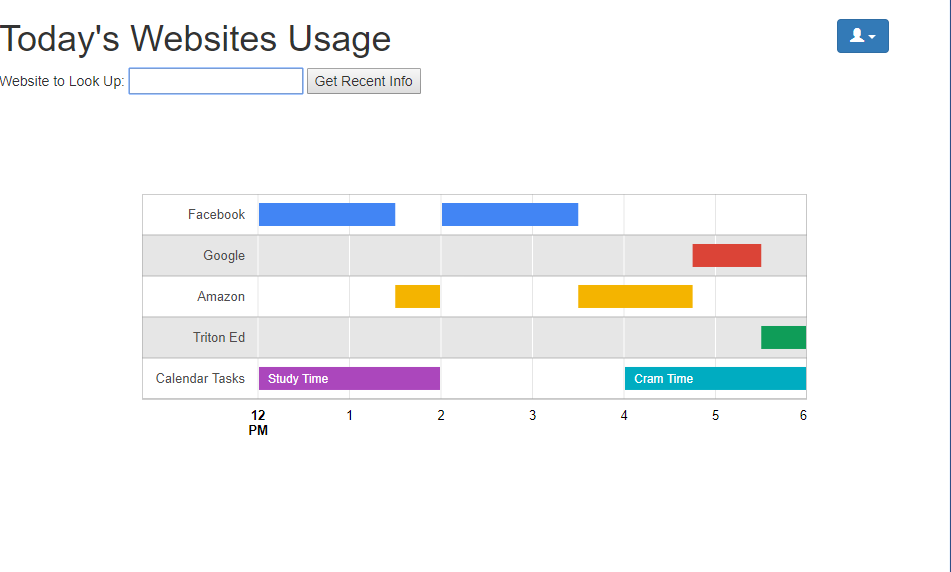
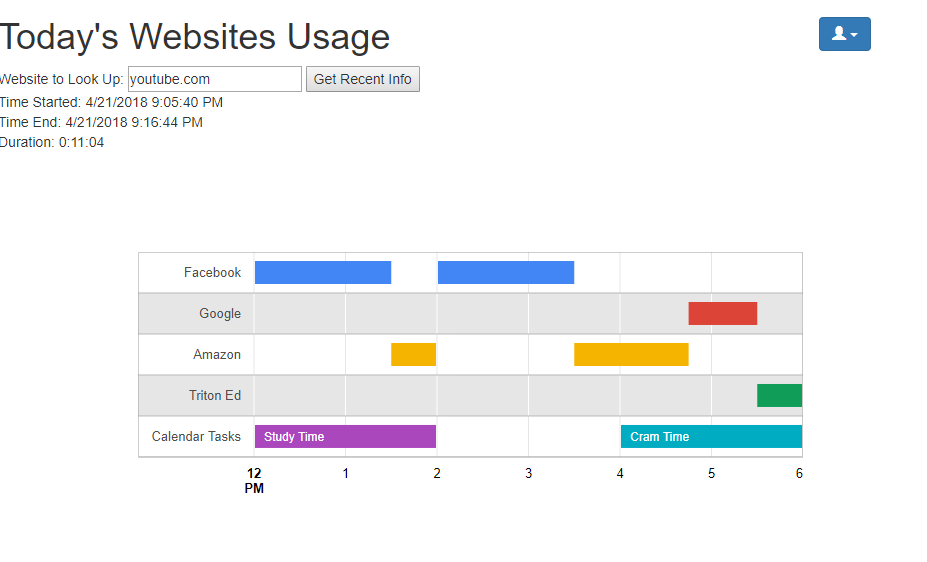

Milestone 4

While in the mileston3, we were only able to display the chart of a static data, now, we can display the data depending on the user’s selection query of a specific website url giving the recent usage of that website given the website is within the database for that date. Moreover, we added a graph of showing the timeline of user's web usage to visually indicate if users got distrupted during the "study time" or not which will be tied to the data in further iterations. 

User Privacy Issue:
First of all, since our app is helping user to track their computer usage, we assume that we are allowed to access their browsing records. However, in terms of user privacy, we will allow users to untrack any website if they wish. Also, we are only keeping the record of the domain name rather than the whole URL, so no one will know the exact page the user browsed.
