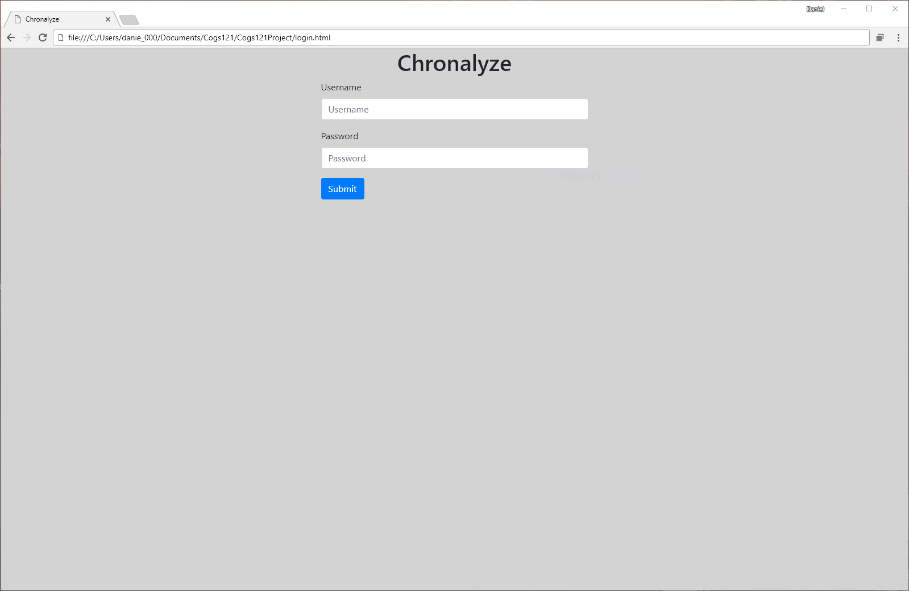
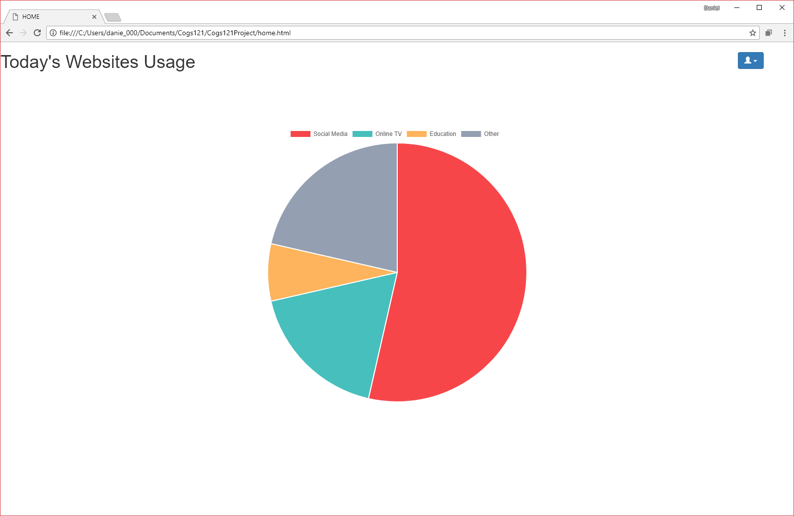
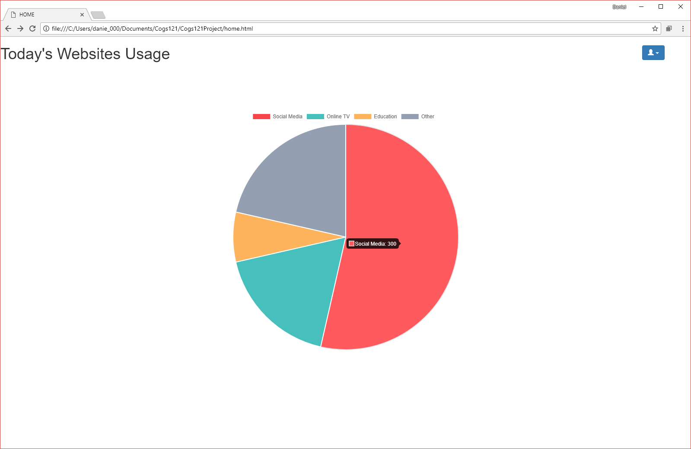
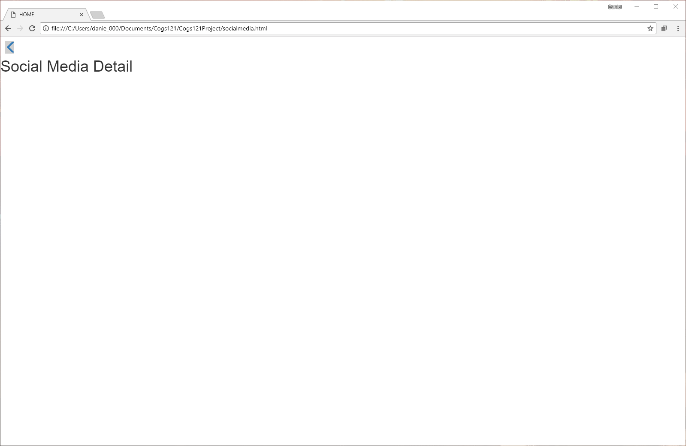
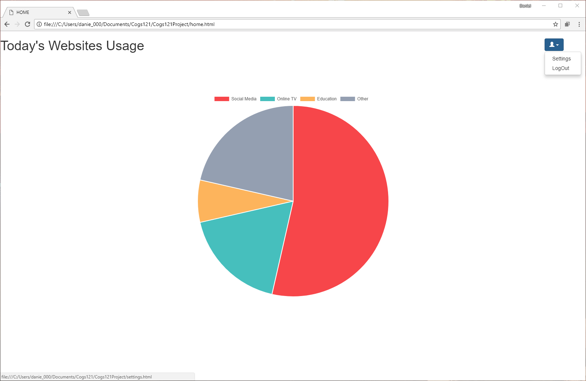
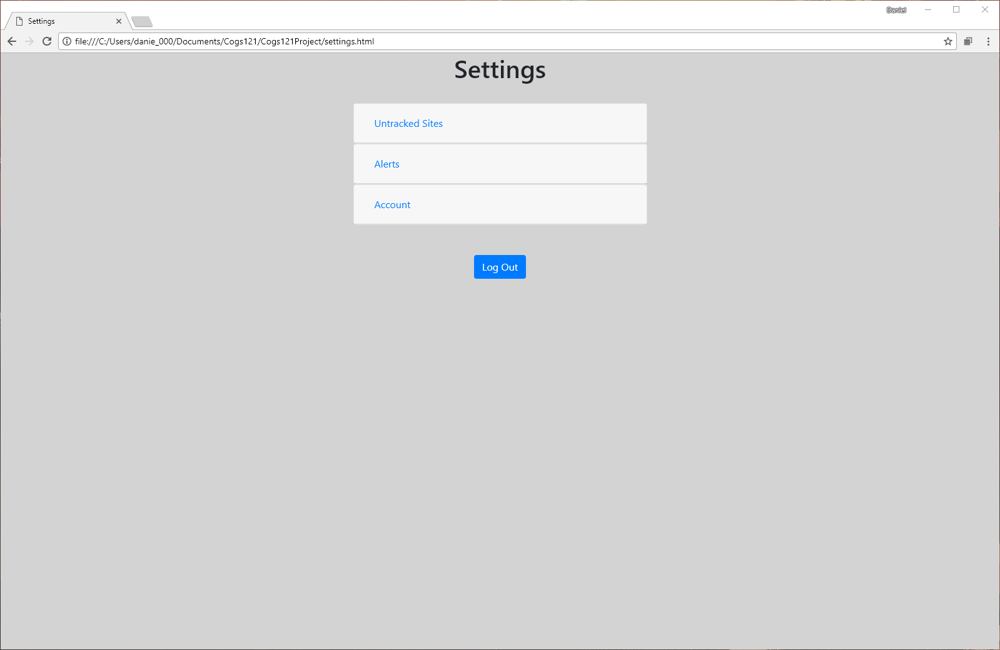

Milestone 3

We've added a login page which was not present in our prototypes.

Our homepage is the same as how we invisioned it in the protoypes.

At this stage, hovering over the pie chart does not display the specific 
websites, but it does detail how much time a person has spent for each
category.

We have pages for the various categories, but we have not implemented
the data charts at this time.

Our account menu has the same layout as in prototype 1.

The settings are the same as the layout we had in prototype 2.

