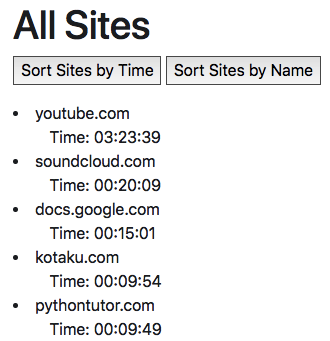

# Milestone 4

### User Action 1:

### User Action 2:

### Improvements:

The home page now displays a greater number of websites, giving the user a more holistic view of their website usage.

When hovering over a section of the timeline, the user can see more precise information about the time they spent on a specific website.

In addition, the user can now view the number of minutes they've spent online in the last week during different times of day.

The user can also track the amount of time they'd spent online during different days of the week.

Through the "Calendar" button in the sidebar, the user can look at all their data from previously recorded days in the form of a timetable.

Total number of minutes spent on a site for a given day is also presented in the form of a list, which can be sorted alphabetically, or by the amount of time spent on that website.
